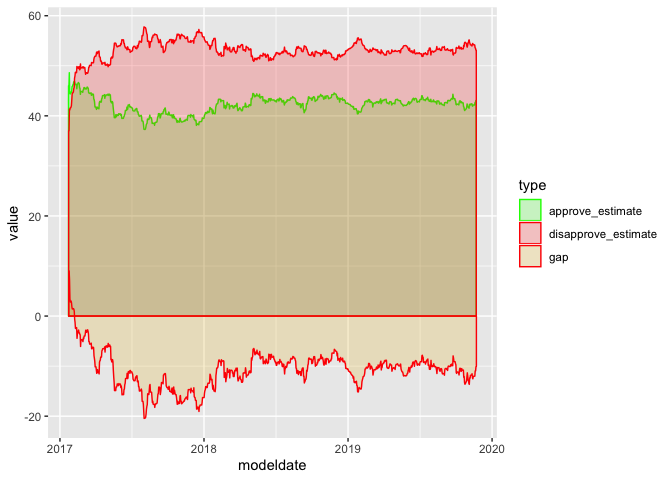

Library & Helpers
-----------------

    library(tidyverse)
    library(lubridate)

    # This helper function will load URL data and store it locally 
    # in a data/ folder for future loading without having to 
    # redownload the file every time.  The function will create the
    # data/ folder if it doesn't already exist.
    # 
    # Note that we are using the readr write_csv() method
    load_cached_url <- function(filename, url) {
      dir.create(file.path('.', 'data'), showWarnings = FALSE)
      fqfn <- paste('./data', filename, sep = '/')

      # Download the file and save it, if we don't have it yet.  
      if(!file.exists(fqfn)) {
        data <- read_csv(url)
        write_csv(data, fqfn)
      }

      # Guess column specification.
      fqfn_spec <- spec_csv(fqfn)
      
      # Identify date columns.
      # Assumption: Column name ends with "date".
      date_cols <- names(fqfn_spec$cols)[str_detect(names(fqfn_spec$cols),
                                         pattern = "date$")]
      
      # Remove one of the date column names, in order to illustrate later the
      # alternative of specifying datatype after reading, too.
      date_cols <- date_cols[-1]

      # Set specification explicitly for date columns.
      for (column in date_cols) {
        fqfn_spec$cols[[column]] <- col_date("%m/%d/%Y")  
      }
      
      # Read file, setting datatypes for all columns.
      data <- read_csv(fqfn, col_types = fqfn_spec)
      
      return(as_tibble(data))
    }

Data Set(s)
-----------

FiveThirtyEight has aggregated polling data from a number of sources
tracking Trump’s approval rating since January 2017. In this programming
vignette, we will use TidyVerse packages to load, manipulate, summarize
and plot Trump’s approval rating over time.

URL:
<a href="https://github.com/fivethirtyeight/data/tree/master/trump-approval-ratings" class="uri">https://github.com/fivethirtyeight/data/tree/master/trump-approval-ratings</a>

There are two CSV files of interest: - [Approved
Polls](https://projects.fivethirtyeight.com/trump-approval-data/approval_polllist.csv)
- [Poll
Results](https://projects.fivethirtyeight.com/trump-approval-data/approval_topline.csv)

readr - read\_csv() and spec\_csv() methods
-------------------------------------------

The readr package provides methods for loading and saving data from both
the local file system and from url’s where data is hosted online. We
will use the read\_csv() and write\_csv() method to load our CSV data
and save it to a local cache.

spec\_csv() allows us to specify datatypes for the read. If
identification of datatypes can be generalized, we can program the
coercion of datatype at run time of the read. In this illustration, the
names of date columns for each input file all end with “date”.
Therefore, we can specify the date datatype upon reading the files.

Otherwise, it is necessary to coerce datatypes after reading. In order
to illustrate this later, we code this vignette intentionally to miss
one of the date columns.

    polls <- load_cached_url(
      'trump-approval-ratings-polls.csv', 
      'https://projects.fivethirtyeight.com/trump-approval-data/approval_polllist.csv'
      )

    results <- load_cached_url(
      'trump-approval-ratings-results.csv',
      'https://projects.fivethirtyeight.com/trump-approval-data/approval_topline.csv')

    head(polls)

    ## # A tibble: 6 x 22
    ##   president subgroup modeldate startdate  enddate    pollster grade
    ##   <chr>     <chr>    <chr>     <date>     <date>     <chr>    <chr>
    ## 1 Donald T… All pol… 11/22/20… 2017-01-20 2017-01-22 Morning… B/C  
    ## 2 Donald T… All pol… 11/22/20… 2017-01-20 2017-01-22 Gallup   B    
    ## 3 Donald T… All pol… 11/22/20… 2017-01-20 2017-01-24 Ipsos    B-   
    ## 4 Donald T… All pol… 11/22/20… 2017-01-21 2017-01-23 Gallup   B    
    ## 5 Donald T… All pol… 11/22/20… 2017-01-22 2017-01-24 Rasmuss… C+   
    ## 6 Donald T… All pol… 11/22/20… 2017-01-20 2017-01-25 Quinnip… B+   
    ## # … with 15 more variables: samplesize <dbl>, population <chr>,
    ## #   weight <dbl>, influence <dbl>, approve <dbl>, disapprove <dbl>,
    ## #   adjusted_approve <dbl>, adjusted_disapprove <dbl>,
    ## #   multiversions <chr>, tracking <lgl>, url <chr>, poll_id <dbl>,
    ## #   question_id <dbl>, createddate <date>, timestamp <chr>

    head(results)

    ## # A tibble: 6 x 10
    ##   president subgroup modeldate approve_estimate approve_hi approve_lo
    ##   <chr>     <chr>    <chr>                <dbl>      <dbl>      <dbl>
    ## 1 Donald T… Voters   11/22/20…             43.0       48.4       37.7
    ## 2 Donald T… Adults   11/22/20…             40.2       44.0       36.4
    ## 3 Donald T… All pol… 11/22/20…             41.9       47.0       36.8
    ## 4 Donald T… Adults   11/21/20…             40.1       43.8       36.4
    ## 5 Donald T… Voters   11/21/20…             43.0       48.3       37.7
    ## 6 Donald T… All pol… 11/21/20…             41.9       47.0       36.8
    ## # … with 4 more variables: disapprove_estimate <dbl>, disapprove_hi <dbl>,
    ## #   disapprove_lo <dbl>, timestamp <chr>

lubridate
---------

In order to demonstrate lubridate, our file reading function
intentionally omitted setting the datatype of the first date columns.
Let’s now make sure all date columns are treated as a date format using
lubridate’s mdy().

    date_cols <- c('modeldate', 'startdate', 'enddate', 'createddate')

    polls$modeldate   <- mdy(polls$modeldate)
    results$modeldate   <- mdy(results$modeldate)

dplyr - filter() & select()
---------------------------

The dplyr:filter() function allows us to filter rows much like a ‘where’
statement in SQL. Here, we will only consider polls of Voters. The
dplyr:select() function will limit which columns are returned. Here, we
only want the date, approval and disapproval values. The dplyr:arrange()
functions allows us to sort the rows by model date. We leverage the
dyplr:gather() function to convert our tibble from wide to long format
which aids with plotting.

    # example filtering, selecting an sorting data
    res <- results %>%
      filter(subgroup == 'Voters') %>%
      select(modeldate, approve_estimate, disapprove_estimate) %>%
      arrange(modeldate)

    # example creating a new column
    res <- res %>%
      mutate(gap = (approve_estimate - disapprove_estimate))

    # example converting to long format for plotting
    res <- res %>% 
      gather('type', 'value', -modeldate) 

    head(res)

    ## # A tibble: 6 x 3
    ##   modeldate  type             value
    ##   <date>     <chr>            <dbl>
    ## 1 2017-01-23 approve_estimate  46  
    ## 2 2017-01-24 approve_estimate  46  
    ## 3 2017-01-25 approve_estimate  48.6
    ## 4 2017-01-26 approve_estimate  44.6
    ## 5 2017-01-27 approve_estimate  44.4
    ## 6 2017-01-28 approve_estimate  44.4

ggplot2
-------

Let’s see how Trump’s approval and disapproval ratings have varied over
time. We also plot the gap, calculated as approval minus disapproval. We
see that very early into his term, Trump’s disapproval rating exceeded
his approval rating and he has maintained a negative gap throughout his
presidency.

    # Multiple line plot
    ggplot(res, aes(x = modeldate, y = value)) + 
      geom_area(aes(color = type, fill = type), 
                alpha = 0.2, position = position_dodge(0.8)) +
      scale_color_manual(values = c("#00FF00", "#ff0000", "#ff0000")) +
      scale_fill_manual(values = c("#00FF00", "#ff0000", "#E7B800")) 

